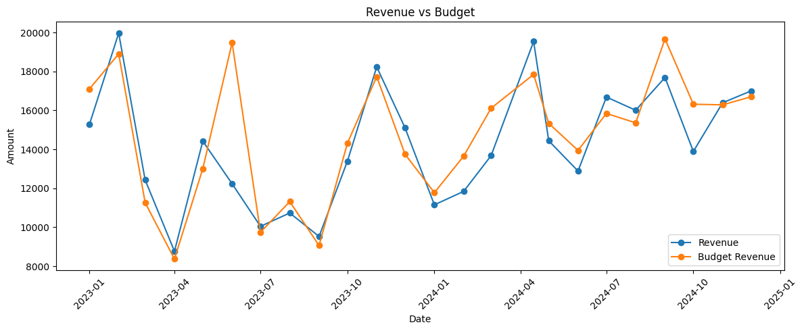
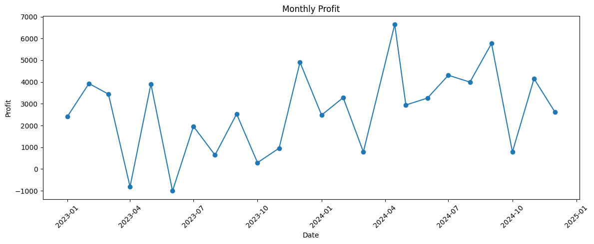
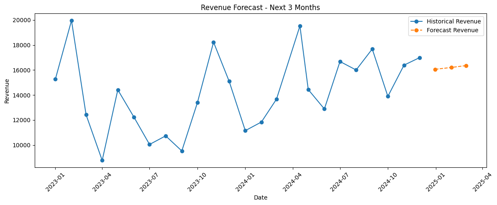

# 📊 Financial Performance Analysis & Forecasting

## 🚀 Project Overview
This project analyzes the financial performance of a company using historical data on revenue, costs, expenses, and budget.

The objective is to simulate a real-world business scenario where a data analyst supports decision-making through:
- financial metrics
- variance analysis
- trend analysis
- forecasting

---

## 📁 Project Structure

The project follows a structured data workflow separating raw data, processed data, analysis, and outputs.

```plaintext
financial-performance-analysis/
│
├── data/
│   ├── raw/              # Original dataset (unchanged)
│   └── processed/        # Cleaned and transformed datasets
│
├── notebooks/            # Exploratory analysis and development
├── src/                  # Reusable Python scripts (ETL logic)
├── dashboard/            # BI dashboards (Power BI / Looker Studio)
├── images/               # Visual assets used in README (charts, previews)
│
├── README.md             # Project documentation
└── requirements.txt      # Python dependencies
```


## 🧠 Business Problem
Companies need to understand:
- Are we meeting our financial targets?
- Where are we losing money?
- How is profitability evolving?
- What should we expect in the next months?

This project answers these questions using data.

---

## 📂 Dataset
The dataset contains monthly financial data:

| Column | Description |
|------|------------|
| date | Month |
| revenue | Total income |
| cost | Cost of goods/services |
| expenses | Operating expenses |
| budget_revenue | Planned revenue |

### ⚠️ Data Issues (intentional)
To simulate real-world scenarios:
- Missing values
- Inconsistent date format
- Outliers in cost

---

## 🧹 Data Cleaning
Performed using Python (pandas):
- Date standardization
- Missing value interpolation
- Outlier detection (IQR method)
- Winsorization of extreme values

---

## 📊 Key Metrics (Feature Engineering)

- **Profit** = Revenue - Cost - Expenses  
- **Margin** = Profit / Revenue  
- **Variance** = Actual Revenue - Budget  
- **Variance %**  

---

## 📈 Analysis

### Key insights:
- Identification of underperforming months
- Budget vs Actual comparison
- Profitability trends over time
- Impact of costs and expenses on margins

---

## 📊 Key Visualizations

### Revenue vs Budget
This chart compares actual revenue against planned targets, helping identify periods of underperformance or overachievement.



---

### Profit Trend
Shows how profitability evolves over time, highlighting the impact of costs and expenses on business performance.



---

### Revenue Forecast
A simple forecasting model projecting future revenue based on historical trends.



---


## 🔮 Forecasting
A simple Linear Regression model was implemented to forecast revenue for the next 3 months.

Purpose:
- Demonstrate planning support capability
- Simulate basic financial forecasting

---

## 🛠️ Tech Stack

- Python (pandas, numpy, matplotlib)
- Jupyter Notebook
- Power BI 

---

## 📊 Dashboard 
Planned dashboard will include:
- KPI cards (Revenue, Profit, Margin, Variance)
- Revenue vs Budget trend
- Monthly variance analysis
- Profit evolution

---


